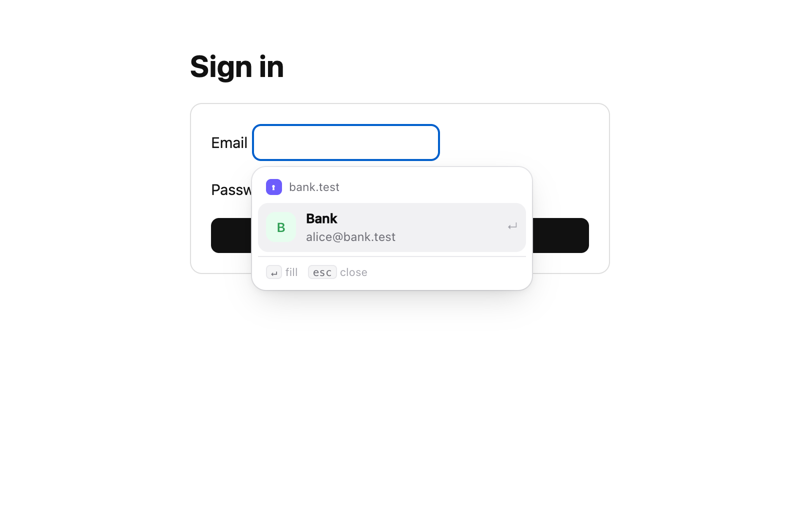
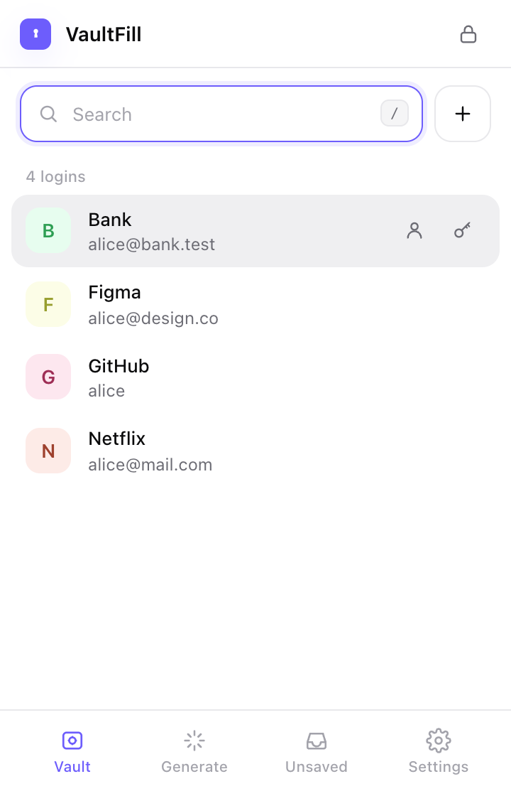
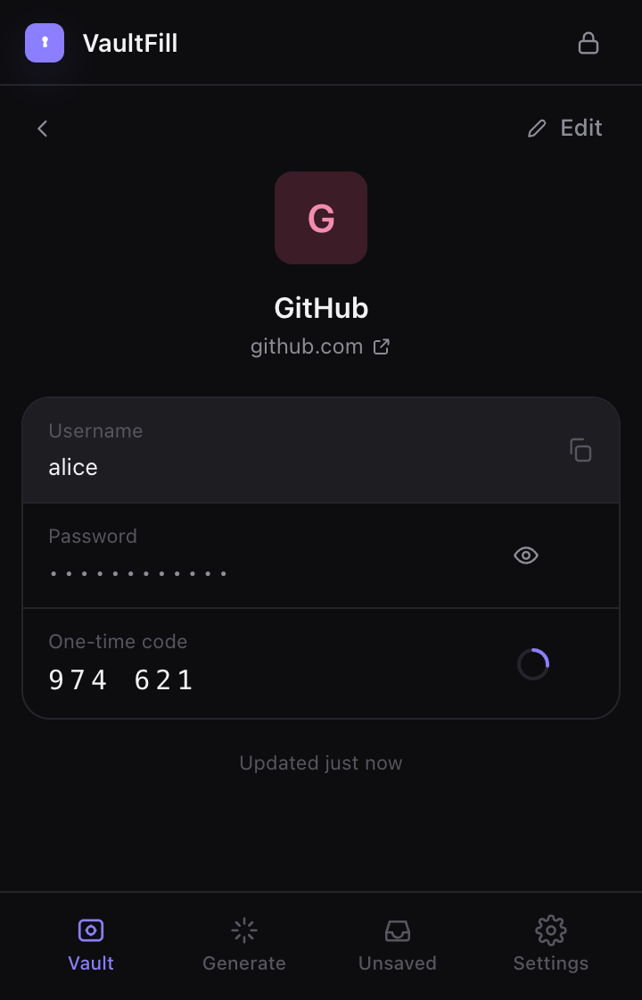
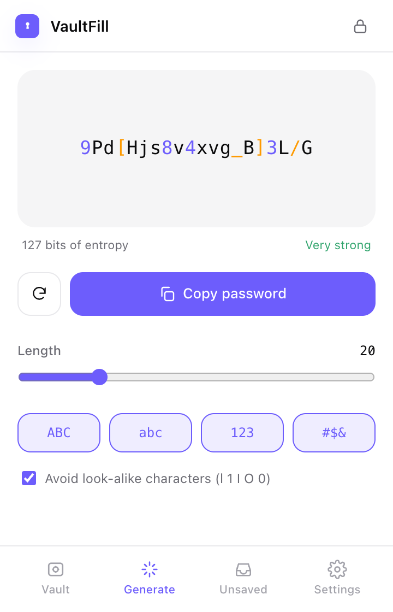
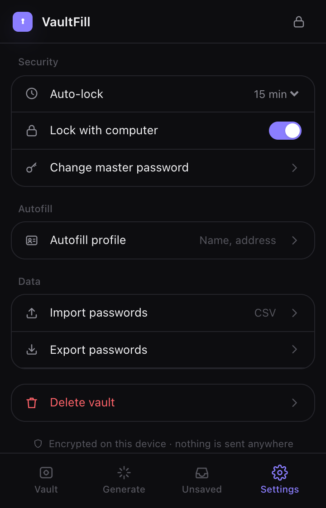
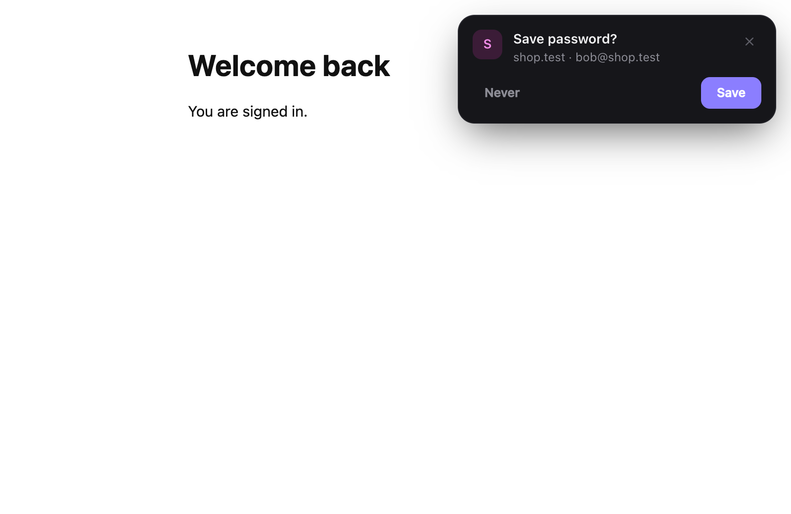
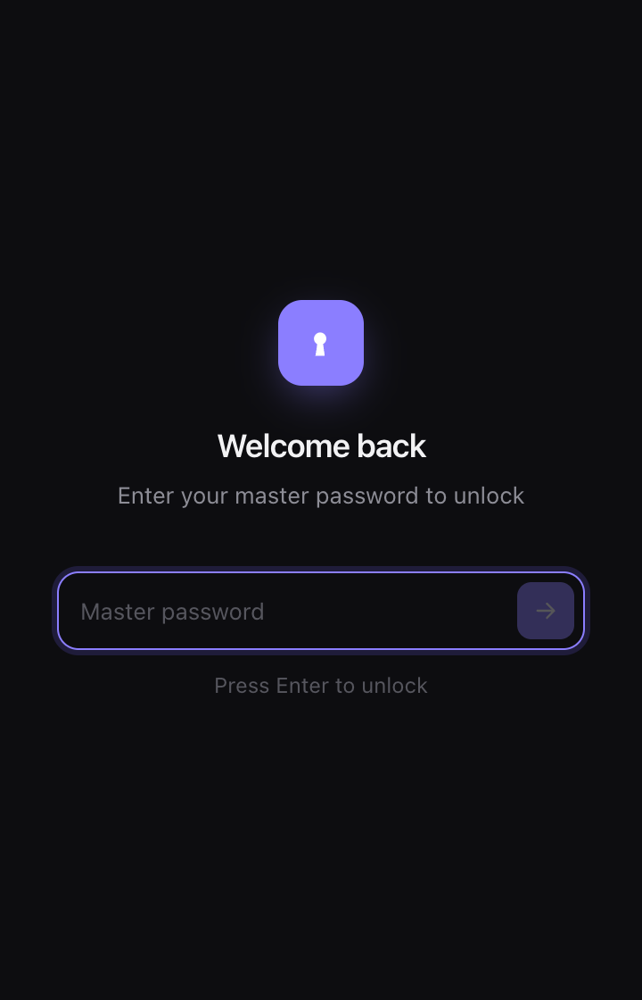

<div align="center">


# VaultFill

**A zero-knowledge password manager with autofill that actually works:**
**on React forms, shadow DOM, split logins and single-page apps.**

Chrome · Edge · Brave · Firefox &nbsp;·&nbsp; Manifest V3 &nbsp;·&nbsp; TypeScript

</div>

<p align="center">
  
</p>

<p align="center">
  
  
  
  
</p>

---

## Why

Popular autofill tools still fail in predictable ways. VaultFill is built around fixing each one:

| Problem | How VaultFill handles it |
|---|---|
| **Fields aren't detected** (shadow DOM, late-loading forms) | Walks open **and closed** shadow roots, watches every root for new fields, and follows single-page-app route changes |
| **React/Vue ignore the filled value** | Writes through the browser's native value setter and fires the same events real typing does |
| **Generated password gets lost** | Saved to memory *before* it reaches the page. After a crash or reload you're offered "Reuse password from 2m ago" |
| **Icons cover the input** | No icon inside the field. The menu opens outside the field and never covers it |
| **Two-step logins break** | The username from step 1 is linked to the password step |
| **Hidden fields steal passwords** | Never fills hidden, transparent, off-screen or covered fields. Nothing fills without a real click or keypress. Logins only match their own registered domain |

## Features

- 🔐 **Zero-knowledge vault:** PBKDF2 (600,000 rounds) and AES-256-GCM, a fresh IV for every entry, stored only on your device
- ⚡ **Smart autofill:** logins, 6-box 2FA codes, name and address forms (including dropdowns)
- ✨ **Password generator:** built into sign-up forms, fills the confirm box too
- 💾 **Save & update prompts:** a clean card after you sign in, plus an **Unsaved** inbox so nothing is lost
- ⌨️ **Keyboard first:** `⌥A` fills and cycles accounts, `/` searches, `↑↓ ↵ esc` everywhere
- 🔢 **Built-in 2FA codes (TOTP)** with a countdown
- 📥 **Import/export CSV** from Chrome, Bitwarden, LastPass, 1Password, Firefox, Dashlane and KeePassXC
- 🌗 **Light & dark mode,** following your system
- 🔒 **Auto-lock** after inactivity and when your computer locks

<p align="center">
  
  &nbsp;
  
</p>

## Quick start

### Use it (no coding needed)

1. Download or clone this repo, then run `npm install && npm run build` (or use a release zip).
2. Open `chrome://extensions` and turn on **Developer mode**.
3. Click **Load unpacked** and select the `.output/chrome-mv3` folder.
4. Pin VaultFill, create a master password, and sign in to any site.

### Develop

You need [Node.js 20+](https://nodejs.org).

```bash
npm install
npm run dev              # Chrome with hot reload
npm run dev:firefox      # Firefox
npm run compile          # type-check
npm test                 # unit tests
npx playwright install chromium
npm run test:e2e         # end-to-end tests in a real browser
npm run zip              # store-ready zip → .output/
```

### Try it on test pages

```bash
npm run serve:test-pages   # → http://localhost:5174
```

There are test forms for plain login, React, shadow DOM, split login, hidden bait fields, sign-up, SPA, iframe, 2FA and address.

## How it works

```
 Web page (every frame)                         Background service worker
 ─────────────────────────────                  ────────────────────────────────────
 Scanner     finds fields, even in shadow DOM   Router   checks who's asking, uses the
 Classifier  username? password? 2FA? address?           browser's own URL for the frame
 Agent       shows the menu, fills fields ───▶  Vault    PBKDF2 → AES-256-GCM, encrypted
 Capture     sees sign-ins, split logins  ───▶  Staging  unsaved passwords (RAM only)
 UI          menu + save card (closed shadow)   Locking  inactivity timer + system lock
                                   ▲
                    Popup (React + Tailwind): vault, generator, unsaved, settings
```

| Folder | What's inside |
|---|---|
| `src/content/` | field detection, classifier, fill engine, capture, in-page UI |
| `src/background/` | encrypted vault, staging buffer, message handlers |
| `src/entrypoints/popup/` | the popup app |
| `src/lib/` | crypto, domain matching, generator, TOTP, CSV, typed messages |
| `tests/` | unit tests (Vitest) |
| `e2e/` + `test-pages/` | browser tests (Playwright) and the pages they run on |

## Security

- **Your master password never leaves your device** and is never stored. It can't be recovered.
- **On disk** there is only encrypted data. A test checks that no username, password or domain is ever written in plain text.
- **While unlocked,** the key is held in the browser's session memory. It's RAM-only, web pages can't read it, and it's wiped when you lock or close the browser.
- **Web pages never see your passwords** in suggestion lists. A password is released only to a frame whose domain matches the saved login.
- **Export** asks for your master password again. Changing the master password re-encrypts everything.
- **No network requests,** no analytics, no remote code. See [PRIVACY.md](PRIVACY.md).

> VaultFill is a new project and hasn't had an independent security audit yet.

## Testing

| Suite | What it covers |
|---|---|
| **52 unit tests** | encryption, vault, security rules between the page and the extension, field classifier, fill events, 2FA (official RFC test values), CSV |
| **14 browser tests** | the real extension in Chromium: React state, open/closed shadow DOM, bait fields, look-alike domains, split login, save prompt, generator after reload, SPA, iframe, `⌥A` cycling, 2FA boxes, address form, locked vault |

## Roadmap

- [ ] Passkeys
- [ ] Encrypted sync between devices
- [ ] Argon2id key derivation
- [ ] Breach and reused-password checks
- [ ] Credit cards
- [ ] Unlock with Touch ID / Windows Hello

## Publishing

See [STORE_LISTING.md](STORE_LISTING.md) for the Chrome Web Store, Edge and Firefox checklist and the permission explanations the reviews ask for.

## License

[MIT](LICENSE) © Sohail Sadiq
